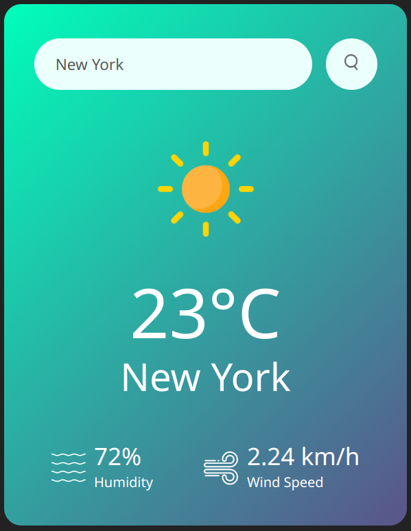

# TheWeatherApp

<p align="center">
  
</p>

## How to Use?
1. Download/Clone the repo.
2. Go to https://openweathermap.org/ and create an account and get api key from https://home.openweathermap.org/api_keys (it may take 2 hours sometime to get activated).
3. Create apikey.js file in the folder and add your apikey from openweathermap here like below and save the file
   ```javascript I'm A tab
   export const apiKey = "your_api_key";
4. Now run the html(or use live server), Prefer live server otherwise browser may throws CORS policy error.
5. you got it!!! Enjoy!!
